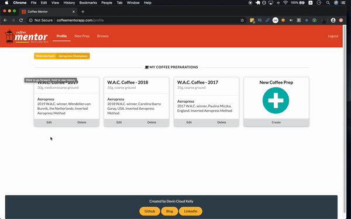

# Coffee Mentor

Welcome! This is the github backend repo for Coffee Mentor. Your single-source to hone your coffee prep skills.

* Create unique coffee preparations based on coffee, brew method and more
* Learn new preparations from other coffee enthusiasts
* Perfect your brew with our brew mapper, which walks you step by step through every brew
* Share your preparations with friends

Check out the [backend repo here](https://github.com/devincloudkelly/coffee-prep-backend)

## Hosted

Coffee Mentor is currently hosted on AWS for everyone to enjoy. Get started at [coffeementorapp.com](http://coffeementorapp.com).

## How It Works

## Why I Made This
After watching countless videos on making better AeroPress and Chemex coffee at home I noticed the methods were very similar, but varied in their duration, process and coffee. I wanted to build something that could help me keep track of my brew process for different coffees, so I came up with Coffee Mentor.

I wanted to learn Redux as well, so I created this app with React for my frontend, using Redux for state management, and a Rails API backend using Postgresql. Coffeementorapp.com uses Auth via BCrypt. All of the styling was done with Semantic UI React

In order to get more feedback and allow others to use this app, I hosted the backend on heroku and the frontend on AWS using S3 and route 53.

